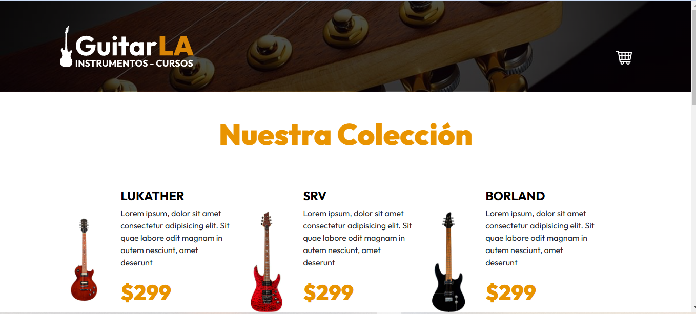

# Guitar_LA

This project simulates an e-commerce site. The main purpose is to practice React concepts through the implementation of a shopping cart.

## Main view of the site:



### Concepts practiced:


- React Components
- State Management
- Event Handling
- Conditional Rendering
- Use of Props and State
- Hooks (useState, useEffect)
- Local Storage
- Props

#### To get the project up and running, follow these steps:

1. Install the dependencies:

   ```bash
   npm i
   ```

2. Start the development server:
   ```bash
   npm run dev
   ```
